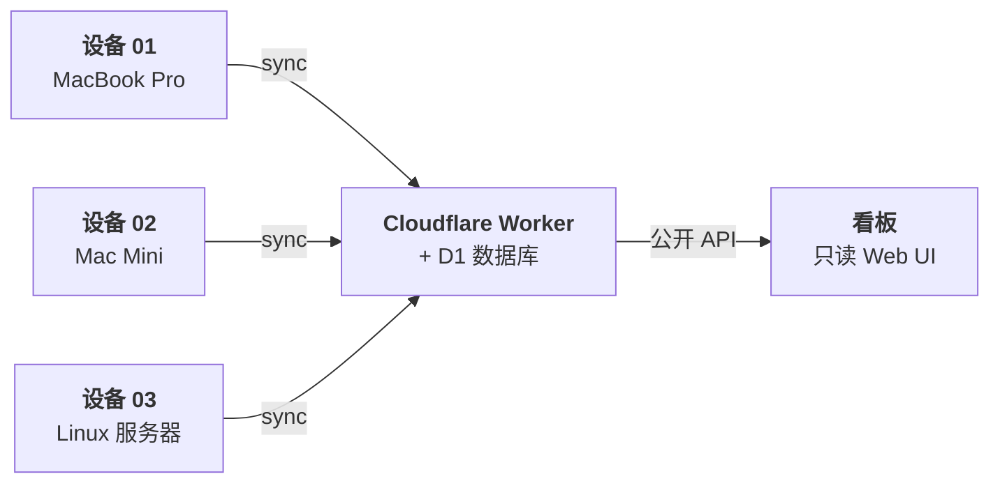

<p align="center"><code>npm i -g @aiusage/cli</code></p>

<p align="center">
  <strong>AIUsage</strong> 追踪所有 AI 工具在所有设备上的 Token 用量与成本，<br>
  同步到你自己的 Cloudflare Worker，通过公开看板可视化一切。
</p>

<p align="center">
  中文 | <a href="./README.md">English</a>
</p>

<p align="center">
  <a href="https://www.npmjs.com/package/@aiusage/cli"></a>
  <a href="https://workers.cloudflare.com"></a>
  <a href="https://developers.cloudflare.com/d1"></a>
  <a href="LICENSE"></a>
</p>

<p align="center">
  <a href="https://aiusage.simplenaive.icu/"><strong>在线演示</strong></a>
</p>

---

## 与上游的区别

- **暖色纸张视觉风格** — 将冷灰 slate 色系替换为暖色 CSS 自定义属性（`--ai-*`），亮/暗模式均适配
- **日期过滤重设计** — 内联 pill 选择（全部 / 今天 / 7天 / 30天 / 自定义）+ 日历弹窗，禁止选择未来日期
- **定价数据 JSON 化** — 将所有模型定价从 `pricing.ts` 抽离到 `pricing.json`，便于维护；修正 o1-mini 定价
- **SPA 路由修复** — `/pricing` 和 `/embed/docs` 不再报 `INTERNAL_ERROR`，从 `run_worker_first` 移除
- **嵌入组件时间范围对齐** — 与主界面 pill 一致（全部 / 今天 / 7天 / 30天）
- **移动端优化** — 过滤 chip 支持触摸横滑；定价页在小屏切换为卡片布局
- **Skeleton shimmer** — 暖色渐变滑动动画替换平淡 pulse
- **DataGuard 组件** — 统一所有图表的不可用状态 / 空状态 / 错误边界逻辑
- **活跃热力图 i18n** — "活跃天数"、"连续天"、"无活动"完整支持中英双语
- **简化 Footer** — 所有页面统一展示：模型定价 · 嵌入组件 · GitHub
- **Header 首页链接** — 点击站点 Logo 可从任意子页面返回主看板

---

## AIUsage 是什么？

一套自托管、隐私优先的系统，用于追踪你在 AI 编程工具上的真实开销——跨所有设备。

### 支持的工具

<p align="center">
  
  
  
  
  
</p>
<p align="center">
  
  
  
  
  
</p>

### 为什么选择 AIUsage？

- **本地扫描** — 读取 AI 工具的会话日志，提取 Token 用量，不触及对话内容
- **多设备同步** — 每台机器独立注册，各自持有安全令牌，数据汇聚到你的 Worker
- **成本可视化** — 公开看板展示趋势、模型分布、单次成本等
- **数据自主** — 部署到你自己的 Cloudflare 账户（免费套餐足够），不依赖任何第三方

### 架构



## 快速开始

### 让 AI 代理帮你部署

复制以下提示词，粘贴给你的 AI 编程代理（Claude Code、Codex、Copilot、Gemini 等）：

```text
克隆 https://github.com/Jozoazhua/aiusage.git，阅读 skills/aiusage-server/aiusage-server.md，
帮我把 AIUsage 部署到我的 Cloudflare 账户。
部署完成后，按照 skills/aiusage-cli/aiusage-cli.md 把这台设备接入。
```

### 或手动部署

```bash
git clone https://github.com/Jozoazhua/aiusage.git
cd aiusage && pnpm install
npx wrangler login
pnpm setup
```

### 本地报告（无需服务端）

```bash
npm i -g @aiusage/cli
aiusage report --range 7d
```

## 保持更新

AIUsage 采用 **Fork 更新模式** — Fork [Jozoazhua/aiusage](https://github.com/Jozoazhua/aiusage)，将你的 Fork 连接到 Cloudflare Workers 的 Git 集成，后续更新自动部署。

1. **Fork** [Jozoazhua/aiusage](https://github.com/Jozoazhua/aiusage) 到你的 GitHub 账户
2. **连接** 你的 Fork 到 Cloudflare Workers（Git 集成）
3. 通过 GitHub 的 "Sync fork" 按钮或 `git merge upstream/main` **同步**更新
4. Cloudflare 在每次推送到你的 Fork 时**自动重新部署**

CLI 更新需单独执行：`npm update -g @aiusage/cli`

详见 [**更新指南**](./docs/update-guide.md)，包含通过 GitHub Actions 实现全自动同步的方案。

## 文档

| 文档 | 说明 |
|------|------|
| [**部署指南**](./docs/deployment-guide.md) | 完整部署流程、CLI 参考、API 文档 |
| [**更新指南**](./docs/update-guide.md) | Fork 更新机制与自动部署设置 |
| [**CLI 文档**](./packages/cli/README.zh-CN.md) | CLI 工具详情与全部命令 |


## 许可证

[MIT](LICENSE)
